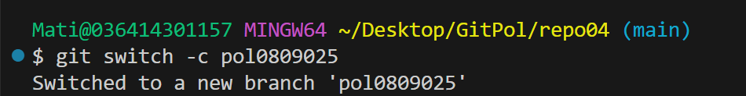
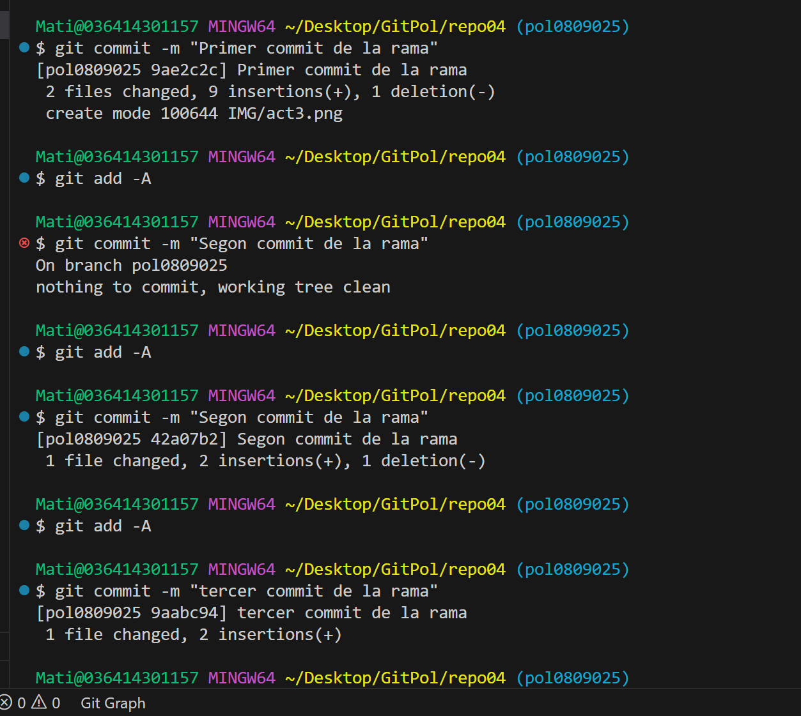
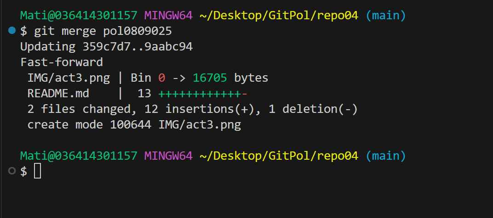
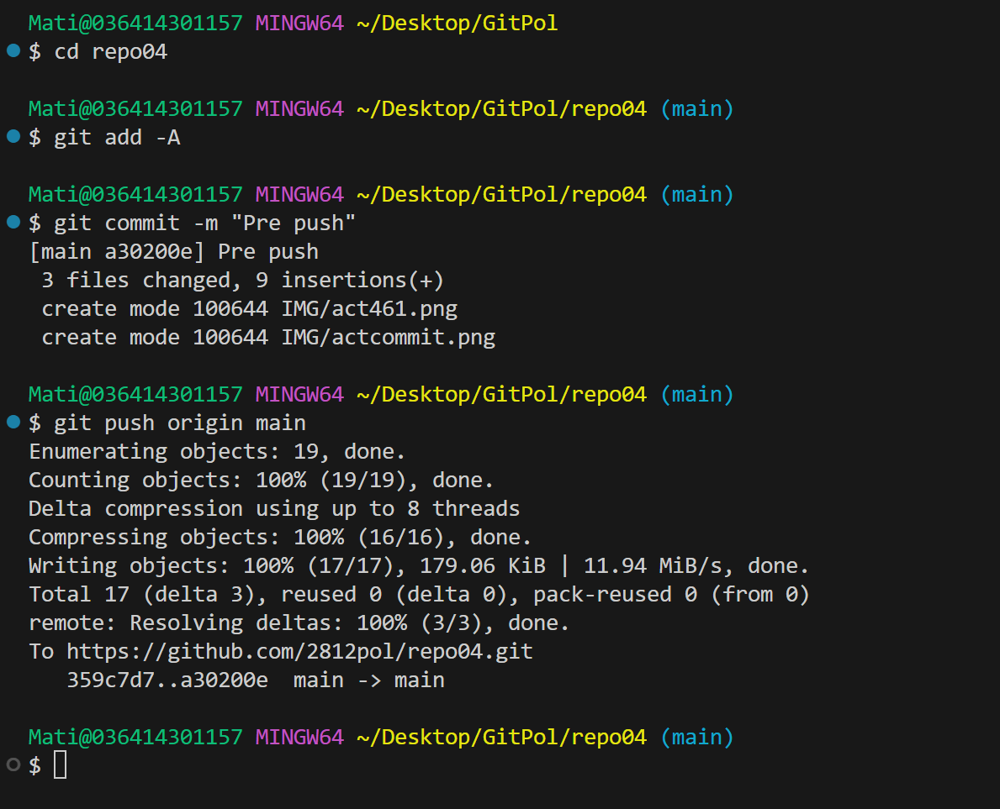
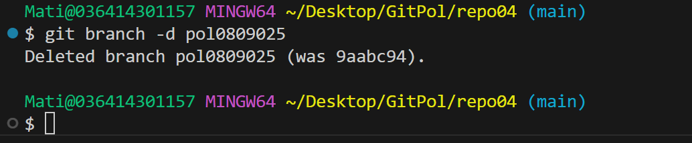
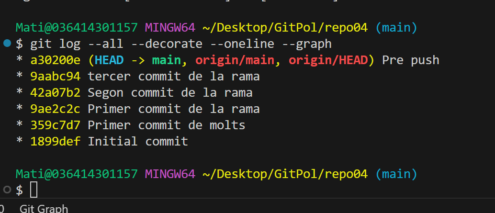
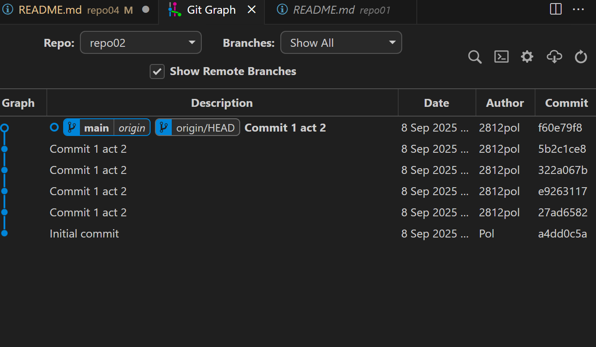

# Excercici 4

ctr+s  
add -A  
commit -m "umpalumpa"   
push origin main

## 4.3

$ git switch -c pol0809025  

Commit numero 1  
Commit numero 2  
Commit numero 3

*****************

Fem un merge de chill 

*****************

Fem un pushg de chill 

*****************

Esborrem branch locally

*******

Amb el comando all dog

Amb el plugin  
